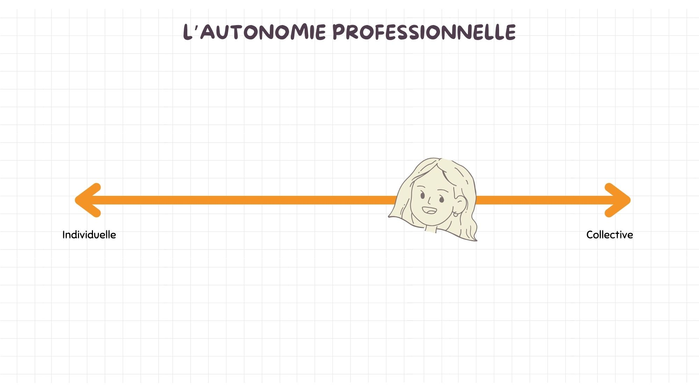

# Portrait 2

## Rapport à la société à travers l'école

### L’approche par compétence et la mobilisation des ressources
Dans les textes concernant l'approche par compétence, on stipulait qu'on ne devait pas nécessairement voir les cours comme des entités séparées, mais bien comme un tout interrelié. Les élèves ont besoin des notions de chaque cour, oui, mais ils doivent aussi apprendre à les assembler ensemble. Plutôt que de donner de grands cours théoriques, on proposait de créer des mises en situation à travers lesquelles les étudiants pourront se développer. Oui, ils ont des notions à apprendre, mais pas que, ils ont aussi des compétences à acquérir. 

**Qu'est-ce qu'une compétence?**
<iframe width="560" height="315" src="https://www.youtube.com/embed/3r97W7TMF24?si=q9IhRECv38uhNaQ0" title="YouTube video player" frameborder="0" allow="accelerometer; autoplay; clipboard-write; encrypted-media; gyroscope; picture-in-picture; web-share" referrerpolicy="strict-origin-when-cross-origin" allowfullscreen></iframe>
Définition inspirée de Basque, J. (Basque, 2015)[^basque].     

**Quelques pistes pour stimuler l'acquisition des compétences**
!!! success "Projet avec d'autres cours"

     Avec certains de mes collègues, nous créons parfois des projets conjoints à réaliser par nos élèves. Dans nos cours respectifs, nous évaluons des éléments différents d'un même projet que nos élèves produisent dans le cadre de nos cours. Cela permet à nos étudiants d'avoir plus de temps pour travailler sur un même projet. De plus, ils développent plus de compétences puisque plutôt que de voir les notions chacun de notre côté, nous essayons d'utiliser les projets pour démontrer les liens existants entre les différents concepts. Par exemple, dans les cours de vidéo et d'animation 2D, nous avons fait une seule vidéo regroupant ces deux médiums.  

!!! warning "Difficulté avec l'évaluation des compétences"

     La BD de T. Trâm[^tram] met en lumière la difficulté d'évaluer l'acquisition de compétences. Malheureusement, il manque encore d'adéquation entre le système scolaire et les approches qu'on recommande en éducation. En effet, comment s'assurer que l'étudiant acquiert les compétences qu'on souhaite développer chez lui si on fait seulement une situation d'apprentissage et qu'il apprend à travers celle-ci? S'il se trompe en chemin, est-ce que cela signifie qu'il coule? Dans le texte, on propose de faire un portfolio de sa progression et que l'étudiant soit évalué sur la démarche et ses réflexions. Ce serait possible, mais ce n'est pas nécessairement l'approche que je préfère. J'aimais bien l'idée proposée dans le portrait 1 de faire beaucoup d'évaluations formatives avec une sommative à la fin. Je crois que cette méthode serait aussi compatible avec l'approche par compétence.  

!!! success "Stages de fin d'étude"

     Dans notre technique, les stages de fin d'études sont obligatoires pour l'obtention du diplôme. Pour moi, ceux-ci représentent l'approche par compétence par excellence. En stage, les étudiants sont amenés à utiliser toutes les compétences qu'ils ont acquises dans leur parcours collégial et à faire des liens entre leurs connaissances pour choisir comment agir dans chaque situation qui leur est présentée. Si certains cours pouvaient reprendre la dynamique du marché du travail et la recréer dans une classe, cela pourrait enrichir l'apprentissage des élèves avant l'étape finale que représente le stage.  

### Le rôle de la personne enseignante au collégial

Pendant ce module, ma perception du rôle de l'enseignant s'est légèrement modifiée. Avant les lectures, pour moi, le rôle de l'enseignant était de transmettre des savoirs aux étudiants, mais surtout de les guider dans leurs apprentissages. J'ai utilisé la métaphore du jardinier qui me semblait à propos puisque l'enseignant donne à ses élèves (fleurs) les ressources dont ils ont besoin pour qu'ils puissent ensuite éclore et s'épanouir. Chacun pousse de façon différente et ne nécessite pas exactement les mêmes soins, le rôle de l'enseignant est de prendre cela en compte dans la transmission des savoirs.

Les lectures m'ont permis de consolider ma vision du rôle de l'enseignant. Oui, l'enseignant est un guide et plutôt que de transmettre ses connaissances, il devrait apprendre à créer des situations qui permettront aux étudiants de développer leurs compétences et leurs savoirs. L'élève est, oui, une fleur qui pousse lorsqu'on lui donne les bons éléments, mais, surtout, une fleur qui se développe à son rythme. Dans le texte de Barbeau et Doucet, on met d'ailleurs cela en lumière: *Quand on jardine, on met les graines en terre et, à un moment donné, on voit les tiges sortir, mais c’est long, c’est lent, comme l’apprentissage chez les élèves. Il faut avoir cette patience d’attendre. On aurait parfois le goût de tirer sur la tige pour que ça aille plus vite, mais si on tire, la tige va se briser. Il faut laisser le temps au temps de faire son travail.* (Barbeau et Doucet, 2009, p.36)[^bon prof] En plus de préciser la métaphore du jardinier, j'ai ajouté celle de l'oiseau. Je trouve que l'image de la maman qui pousse l'oisillon en bas de son nid est appropriée. C'est par la pratique dans des situations réelles que les élèves pourront développer les compétences qui ne se trouvent pas nécessairement dans la théorie. On doit pousser l'élève en bas du nid pour qu'il puisse apprendre par lui-même à voler de ses propres ailes. C'est par la pratique que l'étudiant se développe et découvre ses compétences. Les connaissances ne suffisent pas, il faut aussi savoir comment les appliquer en situation. Tel que mentionné dans la BD de T. Trâm, il ne faut cependant pas oublier notre rôle: *C'est pas en jetant quelqu'un dans la piscine qu'il apprendra à nager! [...] Pour apprendre, il y a besoin d'accompagnement, de corrections, de retours, d'encouragement, de pistes de réflexion et d'amélioration.*  (T. Trâm, 2021, p.16)[^tram] Ainsi, on doit mettre l'élève en situation et lui fournir l'encadrement et les ressources nécessaires à sa progression. 

!!! example "Exemple rôle de l'enseignant"

    Sans en avoir nécessairement conscience, je crée souvent des situations d'apprentissage pour les étudiants. Par exemple, dans mon cours d'introduction au marché du travail, j'organise avec les élèves un *speedjobbing*. Cette activité permet aux étudiants de rencontrer une quinzaine d'employeurs et de faire des entrevues de 3 à 4 minutes avec chacun d'eux. Cette activité est clairement une situation créée qui permet aux étudiants de développer les compétences qui leur seront nécessaires lorsqu'ils iront passer des entrevues d'embauche. Par le biais de situations réelles comme celle-ci, on développe de meilleures compétences chez les élèves que si on les fait pratiquer entre pairs ou dans de fausses mises en situation. Ainsi, lorsqu'on peut se le permettre, c'est enrichissant pour notre enseignement. 

### Favoriser les apprentissages de mes étudiants
<iframe width="560" height="315" src="https://www.youtube.com/embed/GgC5lzPkzeI?si=QSxg0atZkc-WoFHg" title="YouTube video player" frameborder="0" allow="accelerometer; autoplay; clipboard-write; encrypted-media; gyroscope; picture-in-picture; web-share" referrerpolicy="strict-origin-when-cross-origin" allowfullscreen></iframe>

Ici, on revisite la proposition du portrait 1.[^lora]

**En résumé**    
Cette précision de l'approche par projet stipule que l'organisation d'un des projets de la session sera amenée à la façon du marché du travail. Ainsi, la classe représentera une équipe de travail qui doit créer un jeu vidéo. Chaque étudiant aura un rôle selon un organigramme déterminé par les étudiants. La méthode agile qui est beaucoup utilisée dans les organisations de multimédia pourra être expérimentée par les élèves. Ils seront également tous intégrés dans les décisions au cours du processus créatif. 

**Comment cette modification de l'approche par projet consolide l'approche par compétence et mon rôle en tant qu'enseignante?**         

* Fonctionner à la façon d'une entreprise dans la salle de classe permet aux étudiants de mieux comprendre les réalités du marché du travail. Cela leur permet aussi de développer des compétences qui ne sont pas stimulées par les cours magistraux.      
* Dans la BD de T. Tram, on souligne l'élément suivant: *[...] pour que l'étudiant développe une compétence donnée, il faut: des situations d'apprentissage qui devront être la plus proche de la situation professionnelle pour faire sens et travailler sur la complexité.* (T. Trâm, 2021, p.19)[^tram]. Je suis d'accord avec sa proposition. C'est pour cette raison que je souhaite que dans l'un de nos projets, nous agissions comme une grande équipe de travail plutôt que de laisser chaque élève travailler sur son projet en silo.    
* Le rôle de l'enseignant dans ce type de projet est en totale cohérence avec ma nouvelle vision qui est de guider mes étudiants à travers les apprentissages que je souhaite qu'ils réalisent au courant de leur session.      
* J'aime beaucoup la métaphore de Barbeau du professeur comme metteur en scène. C'est de cette façon que je me verrais pour cette approche par projet: *L’enseignant n’est pas celui qui donne le show, il est celui qui doit faire évoluer sur scène une troupe de comédiens amateurs qui auront, eux, à donner la représentation (démontrer l’acquisition des savoirs). Dans cette façon de voir les choses, le professeur est très présent auprès des élèves, il décide de la pièce à jouer, il leur propose son analyse du texte, il organise les répétitions, encadre les comédiens dans
l’apprentissage de leur texte… Les élèves, eux, ne peuvent se contenter d’être des spectateurs dans la classe. Ils doivent être actifs, apprendre leur texte, travailler et retravailler de façon à intégrer si bien la pièce qu’ils pourraient la jouer dans n’importe quelle circonstance de leur vie.* (Barbeau et Doucet, 2009, p.36)[^bon prof]. Ainsi, je créerais une situation pour les étudiants afin qu'ils soient actifs. Je leur donnerais un défi à réaliser et m'assurerais de les encadrer dans la réalisation de celui-ci. Une fois qu'ils auront réussi, ils seront en mesure de reproduire ces étapes, peu importe le contexte.    

## Rapport aux collègues et aux responsabilités

### L'approche programme
L'approche programme est au coeur de notre travail en tant qu'enseignant. Elle implique que nous ne sommes pas des acteurs séparés qui donnons chacun nos cours, mais bien les acteurs d'un tout, d'un programme, qui vise à développer plusieurs compétences chez des étudiants. Cette définition de Prégent, Bernard et Kozanitis (2009) dans le texte de Stéphanie Carle résume bien le tout: *Le deuxième modèle d’organisation de l’enseignement est l’approche-programme. Dans ce dernier cas, l’ensemble des cours du programme repose sur un projet de formation (lignes directrices, principes et applications) élaboré et poursuivi de manière collective et longitudinale par le corps professoral (professeurs et chargés de cours) et les leaders responsables de l’enseignement, dans un esprit de constante collaboration et collégialité. Personne ne s’y sent vraiment propriétaire d’un cours, mais tous collaborent, dans les cours qui leur sont confiés, à la réussite de l’ensemble du programme d’études, et cela, dans une organisation et sous la direction de personnes qui favorisent la transparence, l’interaction entre les cours et les professeurs, la rétroaction et l’amélioration régulière des divers éléments du programme d’études offert aux étudiants. »* (Carle, 2022, p.3)[^steph2]

!!! example "Exemple de manifestation de l'approche-programme"

    Comme les autres programmes, nous avons un plan de formation. Lorsque nous avons mis ce dernier à jour il n'y a pas si longtemps, nous avons créé le profil de sortie de nos étudiants. Selon moi, ce profil représente bien le fonctionnement de l'approche-programme. Chacun des cours devrait aider l'étudiant à développer les compétences attendues dans le profil de sortie. Cela étant clair pour tous, nous nous assurons de travailler dans la même direction pour la réussite de nos élèves. En ayant un modèle précis en tête, nous nous assurons de travailler en concertation pour atteindre un même objectif. La sélection des objectifs d'apprentissages propres à chaque cours nous a également permis de comprendre la place et l'importance de chacun dans le programme. En gardant ces éléments en tête, nous sommes plus à même de comprendre la place de notre cours dans le programme et d'orienter les apprentissages de nos élèves par rapport aux notions qu'il maîtrisent déjà ou qu'ils apprendront dans le futur. 

### L'autonomie professionnelle

Dans le texte de Stéphanie Carle[^steph], on propose une autonomie professionnelle en deux temps, soit celle qui est propre à l'enseignant et l'autonomie collective. De mon côté, j'ai pris ces deux concepts et les ai insérés sur un axe. Pour ma part, je crois que l'autonomie professionnelle est un continuum et qu'elle fluctue selon les situations. On doit prendre certaines décisions de façon plus individuelles, mais, souvent, on doit se référer à la collectivité pour s'assurer de bien faire les choses. Comme nous travaillons tous pour la réussite de nos élèves, il est normal, voire même souhaitable que l'on se consulte autant pour les décisions qui concernent notre département que pour celles qui sont propres à nos cours. Oui on peut choisir la façon dont on enseigne, mais, pour moi, une équipe enseignante forte est soudée et a une façon commune de voir les choses. Chacun peut ensuite enseigner à sa façon à l'intérieur de cette vision commune. 

!!! example "Exemple de manifestation de l'autonomie professionnelle"

    Dans le cadre du cours d'introduction au marché du travail, mes collègues m'ont offert de reprendre leur contenu et de l'adapter. C'est ce que j'ai fait et je me suis parfois sentie prise dans des évaluations qui ne correspondaient pas nécessairement à mes rapports aux savoirs. Ainsi, lorqu'est venu le temps de monter le cours de réalité virtuelle, j'ai plutôt demandé quels étaient les contenus essentiels selon les enseignants. J'ai ensuite vérifié le cahier de programme et j'ai monté mon cours à partir de ces données. Cette manifestation de mon autonomie professionnelle m'a permis d'être plus à l'aise avec mes contenus de cours et d'enseigner une matière que je maîtrisais totalement. Ainsi, cela illustre que j'aime bien me fier à la collectivité tout en gardant une certaine autonomie sur mes décisions. 

### La pratique réflexive
Dans les différents textes, on a appris que la pratique réflexive est un outil qui permet d'analyser notre pratique dans un but de mieux l'orienter et de l'améliorer. La pratique réflexive est une habitude qu'on peut développer pour devenir un meilleur enseignant. Dans son texte, Lenoir[^lenoir] décortique ce procédé en quatre étapes principales reliées par une transition. Voici mon interprétation de chacune des étapes: 

1. Pratique: Pour qu'il y ait réflexion, il doit y avoir une pratique, des actions ou une activité faite par l'enseignant. 
2. Analyse: L'enseignant doit ensuite analyser la pratique. Il peut utiliser une grille d'analyse ou des questions déjà préparées pour vérifier les événements. Le but n'est pas de les juger, mais bien d'observer de façon critique ce qui s'est passé.
3. Généralisation: À cette étape, on veut faire des liens avec la théorie. Essayer de réfléchir et d'interpréter ce qu'on a analysé. On veut trouver les réactions qu'on pourrait avoir face aux conclusions qui sont tirées de notre analyse.
4. Transfert: La pratique réflexive n'est pas une simple réflexion, elle prend tout son sens lorsqu'on met en application les solutions ou les pistes auxquelles on a réfléchi.

Ces étapes sont ensuite répétées en boucle puisque la pratique réflexive n'a pas de fin en soi. Il y a toujours des possibilités d'amélioration par rapport à nos actions. 

Je crois que l'analyse réflexive constitue un bon outil pour améliorer ma pratique enseignante. En effet, ce processus pourrait me permettre de mieux m'analyser en tant que personne avec comme objectif de m'améliorer et d'avoir de meilleures pratiques. De plus, ce procédé pourrait être utile pour remettre en question les principes et les valeurs qui sous-tendent mes pratiques. En aillant une meilleure idée de pourquoi je fais les choses de telle ou telle façon, je pourrai m'améliorer et faire de meilleurs choix. Cependant, je dirais que la surcharge est l'un des freins de mon recours à l'analyse réflexive pour l'instant. En plus de donner mes cours, je suis coordonnatrice de département pour ma technique. Cela prend beaucoup de mon temps et est composé de beaucoup d'imprévus. Ce faisant, il est plus difficile d'établir un calendrier stable et d'insérer de nouveaux éléments dans ma pratique. Cela dit, je suis certaine que plusieurs éléments intéressants pourraient ressortir de ce processus. À première vue, la pratique réflexive ma paraît imposante. Elle est composée de plusieurs éléments qui me semblent parfois longs et fastidieux à mettre en place. Cependant, j'y vois plusieurs avantages possibles. Aussi, c'est sûr que l'aspect de constamment se remettre en question afin de s'améliorer fait un peu peur. Ça donne un peu l'impression qu'on n'en fera jamais assez ou que rien ne pourra jamais être parfait. Dans la société où l'on vit qui cherche à constamment viser la perfection, ça représente un changement de paradigme que d'accepter qu'on est assez et qu'il y a tout de même toujours place à l'amélioration. 

### L'éthique professionnelle
<iframe width="560" height="315" src="https://www.youtube.com/embed/kCHXW3lPFvo?si=V7ULvezYIYv4g_M8" title="YouTube video player" frameborder="0" allow="accelerometer; autoplay; clipboard-write; encrypted-media; gyroscope; picture-in-picture; web-share" referrerpolicy="strict-origin-when-cross-origin" allowfullscreen></iframe>

### Favoriser les apprentissages de mes étudiants

<iframe width="560" height="315" src="https://www.youtube.com/embed/oRMc9AAN4Ro?si=XII2cLHlOwxh3QE1" title="YouTube video player" frameborder="0" allow="accelerometer; autoplay; clipboard-write; encrypted-media; gyroscope; picture-in-picture; web-share" referrerpolicy="strict-origin-when-cross-origin" allowfullscreen></iframe>

**En résumé**    
J'aimerais essayer d'introduire l'approche réflexive dans ma pratique. Voici la façon dont je compte m'y prendre pour éviter que cela devienne une tâche lourde et demandante. 

**Comment cette nouvelle pratique est en cohérence avec mon rôle et mes responsabilités en tant qu'enseignante?**         

* La pratique réflexive est un outil qui me permettra de mieux cerner les besoins de mes élèves. Grâce à ma grille d'analyse, je pourrai réfléchir aux difficultés qu'ils rencontrent et surtout essayer de trouver des solutions à mettre en place pour aider les étudiants.
* Je crois que j'arriverai à suivre ma méthode assez facilement, puisque, tel que mentionné dans mes forces de caractères, je suis une personne très assidue. Ainsi, si je me donne un objectif, je ferai ce qui est en mon pouvoir pour le respecter. Selon le texte de Lenoir, une fois l'habitude développée, je n'aurai plus à y penser pour le faire: *une fois le nouvel habitus acquis et intégré, qui recourt systématiquement à l’analyse réflexive à partir d’une grille d’analyse qui est elle-même incorporée à nos actions, l’usage de l’analyse réflexive devient “naturel” au point où elle devient pratiquement inconsciente.* (Lenoir, 2012, p.13)[^lenoir]
* Cette pratique me permettra aussi de réfléchir à mon éthique professionnelle et les solutions que je chercherai pourrons être orientées vers le respect des cinqs valeurs au coeur de mon département.
* L'utilisation de mes propres questions créées dans le cadre du cours performa sera intéressante pour l'analyse réflexive. En effet, ces questions expriment les préoccupations que j'ai et me permettront de me concentrer sur les éléments qui m'importent en tant que professeur. 

## Bibliographie

[^bon prof]: [Barbeau, D. et Doucet, S. (2009). En 2009, c’est quoi un « bon prof » ?. Pédagogie collégiale, 22 (3), 35-37.](https://eduq.info/xmlui/handle/11515/21746)
[^basque]: [Basque, J. (2015). Le concept de compétences : Quelques définitions. Dans Projet MAPES (Modélisation de l’approche-programme en enseignement supérieur), Réseau de l’Université du Québec.](https://pedagogie.uquebec.ca/sites/default/files/documents/outils/r_2.1-1_le_concept_de_competence_quelques_definitions.pdf)  

[^lora]: [Boisvert, L. (2024). Portrait 1. Dans Blogue personnel.](https://flora0510.github.io/performa_portrait/portraits_performa/premier_portrait.html#favoriser-les-apprentissages-de-mes-etudiants)

[^steph]: [Carles, S. (2022) L'autonomie professionnelle. Collège Montmorency.](https://moodle.usherbrooke.ca/pluginfile.php/4181938/mod_page/content/47/Carle_Autonomie%20professionnelle_2022.pdf)  

[^steph2]: [Carles, S. (2022) L'approche programme au collégial. Collège Montmorency.](https://moodle.usherbrooke.ca/pluginfile.php/4181938/mod_page/content/47/Carle_Approche%20programme_2022.pdf)  

[^tram]:[Dang Ngoc, T. Trâm. (2021, 1 mars). Approche par compétences. Dans Blogue personnel.](https://bit.ly/3qIGbzb)

[^lenoir]:[Lenoir, Y. (2012). Réfléchir dans et sur sa pratique, une nécessité indispensable. Université de Sherbrooke.](https://www.usherbrooke.ca/creas/fileadmin/sites/creas/documents/Publications/Destinees_aux_professionnels/Analyse_re__flexive-Outil1_Lenoir.pdf)
