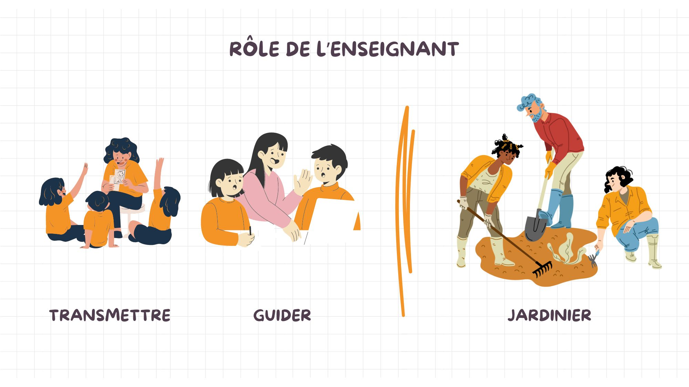

# Portrait 2

## Rapport à la société à travers l'école
Synthétisez les éléments significatifs qui émergent de vos réflexions quant au rapport à la société à travers l’école : l’approche par compétence et la mobilisation des ressources; et le rôle de la personne enseignante au collégial.

### L’approche par compétence et la mobilisation des ressources
Synthétisez les éléments significatifs qui émergent de vos réflexions quant au rapport à la société à travers l’école 
Décrivez comment ces éléments quant au rapport à la société à travers l’école se manifestent dans vos pratiques enseignantes, en donnant des exemples pour illustrer dans quelle mesure vos pratiques sont en cohérence ou non avec le rôle et les responsabilités attendues de la personne enseignante au collégial. 

### Le rôle de la personne enseignante au collégial

Pendant ce module, ma perception du rôle de l'enseignant s'est légèrement modifiée. Avant les lectures, pour moi, le rôle de l'enseignant était de transmettre des savoirs aux étudiants, mais surtout de les guider dans leurs apprentissages. J'ai utilisé la métaphore du jardinier qui me semblait à propos puisque l'enseignant donne à ses élèves (fleurs) les ressources dont ils ont besoin pour qu'ils puissent ensuite éclore et s'épanouir. Chacun pousse de façon différente et ne nécessite pas exactement les mêmes soins, le rôle de l'enseignant est de prendre cela en compte dans la transmission des savoirs.

Les lectures m'ont permis de consolider ma vision du rôle de l'enseignant. Oui, l'enseignant est un guide et plutôt que de transmettre ses connaissances, il devrait apprendre à créer des situations qui permettront aux étudiants de développer leurs compétences et leurs savoirs. L'élève est, oui, une fleur qui pousse lorsqu'on lui donne les bons éléments, mais, surtout, une fleur qui se développe à son rythme. Dans le texte de Barbeau et Doucet, on met d'ailleurs cela en lumière: *Quand on jardine, on met les graines en terre et, à un moment donné, on voit les tiges sortir, mais c’est long, c’est lent, comme l’apprentissage chez les élèves. Il faut avoir cette patience d’attendre. On aurait parfois le goût de tirer sur la tige pour que ça aille plus vite, mais si on tire, la tige va se briser. Il faut laisser le temps au temps de faire son travail.* (Barbeau et Doucet, 2009, p.36)[^bon prof] En plus de préciser la métaphore du jardinier, j'ai ajouté celle de l'oiseau. Je trouve que l'image de la maman qui pousse l'oisillon en bas de son nid est approprié. C'est par la pratique dans des situations réelles que les élèves pourront développer les compétences qui ne se trouvent pas nécessairement dans la théorie. On doit pousser l'élève en bas du nid pour qu'il puisse apprendre par lui-même à voler de ses propres ailes. C'est par la pratique que l'étudiant se développe et découvre ses compétences. Les connaissances ne suffisent pas, il faut aussi savoir comment les appliquer en situation. 

!!! example "Exemple rôle de l'enseignant"

    Sans en avoir nécessairement conscience, je crée souvent des situations d'apprentissage pour les étudiants. Par exemple, dans mon cours d'introduction au marché du travail, j'organise avec les élèves un *speedjobbing*. Cette activité permet aux étudiants de rencontrer une quinzaine d'employeur et de faire des entrevues de 3 à 4 minutes avec chacun d'eux. Cette activité est clairement une situation créée qui permet aux étudiants de développer les compétences qui leur seront nécessaires lorsqu'ils iront passer des entrevues d'embauche. Par le biais de situation réelles comme celle-ci, on développe de meilleure compétences chez les élèves que si on les fait pratiquer entre pairs ou dans de fausses mises en situation. Ainsi, lorsqu'on peut se le permettre, c'est enrichissant pour notre enseignement. 

### Favoriser les apprentissages de mes étudiants
Expliquez un moyen réaliste que vous comptez mettre en place pour favoriser les apprentissages de vos élèves pour être davantage en cohérence avec le rôle et les responsabilités attendues de la personne enseignante au collégial, quant au rapport à la société à travers l’école. Appuyez-vous sur les savoirs du cours pour justifier vos décisions. Assurez-vous de citer vos références selon les normes attendues. Précisez comment vos forces de caractère peuvent devenir des leviers pour la mise en œuvre de votre moyen. 

## Rapport aux collègues et aux responsabilités
Synthétisez les éléments significatifs qui émergent de vos réflexions quant au rapport aux collègues : l’approche programme; et au rapport aux responsabilités : l’autonomie professionnelle, la pratique réflexive et l’éthique professionnelle.  
### L'approche programme
Décrivez comment ces éléments quant au rapport aux collègues et le rapport aux responsabilités se manifestent dans vos pratiques enseignantes, en donnant des exemples pour illustrer dans quelle mesure vos pratiques sont en cohérence ou non avec le rôle et les responsabilités attendues de la personne enseignante au collégial. 

### L'autonomie professionnelle
Décrivez comment ces éléments quant au rapport aux collègues et le rapport aux responsabilités se manifestent dans vos pratiques enseignantes, en donnant des exemples pour illustrer dans quelle mesure vos pratiques sont en cohérence ou non avec le rôle et les responsabilités attendues de la personne enseignante au collégial. 

### La pratique réflexive
Décrivez comment ces éléments quant au rapport aux collègues et le rapport aux responsabilités se manifestent dans vos pratiques enseignantes, en donnant des exemples pour illustrer dans quelle mesure vos pratiques sont en cohérence ou non avec le rôle et les responsabilités attendues de la personne enseignante au collégial. 

### L'éthique professionnelle
<iframe width="560" height="315" src="https://www.youtube.com/embed/kCHXW3lPFvo?si=V7ULvezYIYv4g_M8" title="YouTube video player" frameborder="0" allow="accelerometer; autoplay; clipboard-write; encrypted-media; gyroscope; picture-in-picture; web-share" referrerpolicy="strict-origin-when-cross-origin" allowfullscreen></iframe>

### Favoriser les apprentissages de mes étudiants
Expliquez un moyen réaliste que vous comptez mettre en place pour favoriser les apprentissages de vos élèves pour être davantage en cohérence avec le rôle et les responsabilités attendues de la personne enseignante au collégial, quant au rapport aux collègues et le rapport aux responsabilités. Appuyez-vous sur les savoirs du cours pour justifier vos décisions. Assurez-vous de citer vos références selon les normes attendues. Précisez comment vos forces de caractère peuvent devenir des leviers pour la mise en œuvre de votre moyen. 

## Bibliographie

[^bon prof]: [Barbeau, D. et Doucet, S. (2009). En 2009, c’est quoi un « bon prof » ?. Pédagogie collégiale, 22 (3), 35-37.](https://eduq.info/xmlui/handle/11515/21746)
