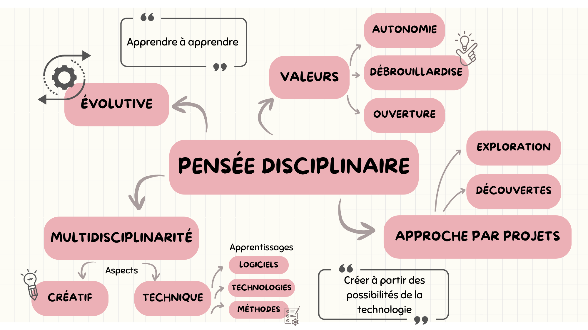

---
hide:
  - toc
---

# Portrait 1 

## Rapport à soi   

### Mes forces   

!!! example "Curiosité et intérêt accordé au monde"

    Je porte attention à tout ce qui m'entoure. J'aime savoir comment les choses fonctionnent et en apprendre sur le plus de sujets possible. J'essaie de stimuler la curiosité de mes élèves. 
    
!!! note "Amour de l’étude, de l’apprentissage"

    Pas très étonnant! J'adore apprendre de nouvelles choses. J'enseigne puisque j'aime aussi transmettre ce que j'apprends.
    
!!! abstract "Assiduité, application, et persévérance "

    Je suis très assidue. J'aime être présente autant pour mes élèves que pour les enseignants que je coordonne. 

!!! info "Honnêteté, intégrité, et sincérité"

    Cette force se révèle utile lors de la notation des étudiants. Pour moi il est important que chacun soit évalué de façon honnête. Je donne autant des bons commentaires que d'autres à améliorer pour aider les étudiants. 

!!! tip "Gentillesse et générosité"

    J'aime beaucoup aider les autres. Lorsqu'un étudiant ne comprends pas une notion, je cherche des façons différentes de lui expliquer pour qu'il arrive à mieux cerner le sujet. Voir les autres réussir est aussi satisfaisant pour moi que de réussir par moi-même. 

### Ma pensée disciplinaire

### Mes rapports aux savoirs et ceux de mes élèves

### Mes croyances au sujet de l’intelligence

### Rapport à soi et pratiques enseignantes
Décrivez comment vos conceptions quant au rapport à soi se manifestent dans vos pratiques enseignantes, en donnant des exemples pour illustrer dans quelle mesure vos pratiques sont en cohérence ou non avec vos conceptions actuelles en éducation.

### Favoriser les apprentissages de mes étudiants
Expliquez un moyen réaliste que vous comptez mettre en place pour favoriser les apprentissages de vos élèves pour être davantage en cohérence avec vos conceptions en éducation quant au rapport à soi. Appuyez-vous sur les savoirs du cours pour justifier vos décisions. Assurez-vous de citer vos références selon les normes attendues. Précisez comment vos forces de caractère peuvent devenir des leviers pour la mise en œuvre de votre moyen. 

## Rapport au travail 

Note bas de page[^unity] test

[^unity]: [Bonnes pratiques pour organiser votre jeu vidéo](https://unity.com/how-to/organizing-your-project) (En anglais)

