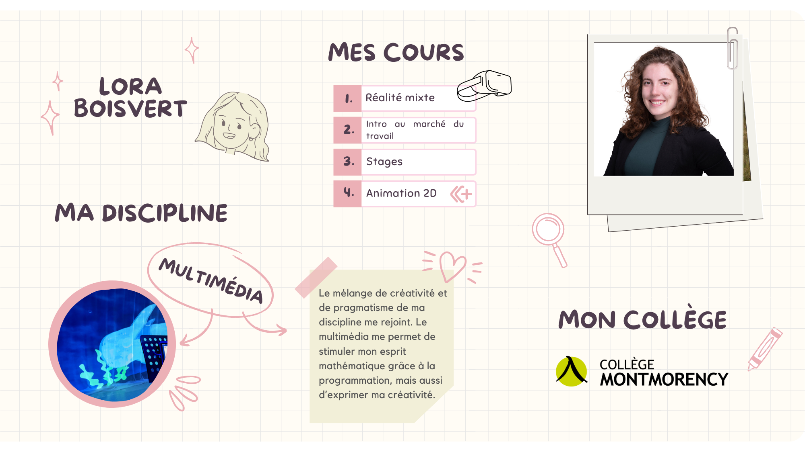

# Portrait 1 

## Rapport à soi   

### Mes forces   

!!! example "Curiosité et intérêt accordé au monde"

    Je porte attention à tout ce qui m'entoure. J'aime savoir comment les choses fonctionnent et en apprendre sur le plus de sujets possible. J'essaie de stimuler la curiosité de mes élèves. 
    
!!! note "Amour de l’étude, de l’apprentissage"

    Pas très étonnant! J'adore apprendre de nouvelles choses. J'enseigne puisque j'aime aussi transmettre ce que j'apprends.
    
!!! abstract "Assiduité, application, et persévérance "

    Je suis très assidue. J'aime être présente autant pour mes élèves que pour les enseignants que je coordonne. 

!!! info "Honnêteté, intégrité, et sincérité"

    Cette force se révèle utile lors de la notation des étudiants. Pour moi il est important que chacun soit évalué de façon honnête. Je donne autant des bons commentaires que d'autres à améliorer pour aider les étudiants. 

!!! tip "Gentillesse et générosité"

    J'aime beaucoup aider les autres. Lorsqu'un étudiant ne comprends pas une notion, je cherche des façons différentes de lui expliquer pour qu'il arrive à mieux cerner le sujet. Voir les autres réussir est aussi satisfaisant pour moi que de réussir par moi-même. 

### Ma pensée disciplinaire
<iframe width="560" height="315" src="https://www.youtube.com/embed/tEDNQn2Yt8A?si=LjRo_n12DeIderwq" title="YouTube video player" frameborder="0" allow="accelerometer; autoplay; clipboard-write; encrypted-media; gyroscope; picture-in-picture; web-share" referrerpolicy="strict-origin-when-cross-origin" allowfullscreen></iframe>

### Mes rapports aux savoirs 
<iframe width="560" height="315" src="https://www.youtube.com/embed/wgs2Ybh_1d0?si=zXnMkxwpZ6VYp_6Y" title="YouTube video player" frameborder="0" allow="accelerometer; autoplay; clipboard-write; encrypted-media; gyroscope; picture-in-picture; web-share" referrerpolicy="strict-origin-when-cross-origin" allowfullscreen></iframe>

Tableau inspiré de Gagnon, M.[^Gagnon].

!!! info "Note sur la vidéo"

    L'exemple ci-haut est appliqué à la réalité virtuelle, mais dans tous les cours que je donne, mes rapports aux savoirs sont similaires. 

**Par rapport à ce qu'on vient d'apprendre sur mes rapports aux savoirs quelle est ma vision dominante dans ces axes?**    
Selon le tableau présenté dans le cours[^axes], ma vision dominante du monde ou du moins de mon enseignement est le socioconstructivisme. Pour moi, les savoirs ne sont pas fixes et on peut les développer en expérimentant en groupe. L'approche par projet que je préconise est tirée de cette vision. C'est en discutant et en échangeant des opinions que les élèves créent leurs savoirs. Évidemment, ce n'est pas le seul rapport au savoir qui me rejoint. C'est à travers un mélange que j'enseigne. Au début des sessions, j'ai une approche plus positiviste. Je donne plusieurs éléments théoriques aux élèves pour qu'ils apprennent les logiciels. Je m'assure qu'ils soient bien outillés pour pouvoir ensuite expérimenter. Après cela, je me rapproche de l'induction pour que les élèves tirent leurs propres conclusions par la pratique. C'est vers la fin de la session que des projets nous permettent de réinvestir les apprentissages et de les pousser plus loin grâce à une approche socioconstructiviste. En groupe, on analyse les projets, chacun tire des éléments différents qui le rejoignent ou non à travers la vision artistique et créative. 

### Rapports aux savoirs de mes élèves
<iframe width="560" height="315" src="https://www.youtube.com/embed/dI-g7UXtNXs?si=cJgdEvtbqRqMo-du" title="YouTube video player" frameborder="0" allow="accelerometer; autoplay; clipboard-write; encrypted-media; gyroscope; picture-in-picture; web-share" referrerpolicy="strict-origin-when-cross-origin" allowfullscreen></iframe>

Tableau inspiré de Gagnon, M.[^Gagnon].

### Mes croyances au sujet de l’intelligence
Je trouve que la mentalité de croissance est un concept intéressant. Je crois que personne n'a les mêmes talents à la base, mais que tous ont la capacité d'apprendre et de se développer s'ils y mettent les efforts. Pour moi, il est faux de dire que tout le monde doit mettre le même niveau d'efforts pour arriver au même résultat. Cependant, je crois que tous ont une chance d'arriver à un résultat similaire même si le chemin pour s'y rendre est bien différent. D'ailleurs, c'est pourquoi donner un cours à de nombreux étudiants peut parfois être ardu. Pour certains, peu de temps sera nécessaire pour comprendre un concept et l'appliquer alors que d'autres auront besoin de beaucoup de pratique et de répétition pour y arriver. 

### Rapport à soi et pratiques enseignantes
**Pas toujours évident d'avoir des pratiques enseignantes en adéquation avec notre rapport à soi! Voici quelques exemples bons et moins bons pour illustrer cela:**

!!! success "Succès des sorties scolaires"

     Dans mes forces, on a constaté que je suis très curieuse. J'essaie de stimuler la curiosité de mes élèves pour la matière et l'une des méthodes qui fonctionne bien pour cela est les sorties scolaires ou la venue de conférenciers dans les cours. Visiter le milieu dans lequel ils évolueront après la technique amène souvent des questionnements aux étudiants. Être confronté au milieu permet également aux élèves de sortir du cadre scolaire et de se rappeler que tout ce qu'ils apprennent leur servira dans le futur. Voir comment ce qu'on apprend en classe est utilisé par les entreprises est souvent un grand facteur de motivation pour les élèves. En étant en contact avec les gens de l'extérieur, les élèves et moi-même fortifions notre pensée disciplinaire. 
     

!!! warning "Difficulté d'adéquation entre ma vision de l'intelligence et mon enseignement"

     L'une des difficultés que je trouve en tant qu'enseignante est d'avoir un grand nombre d'apprenants. Chaque élève a son propre niveau et ses besoins. Je crois en la mentalité de croissance et au fait que chacun peut se développer s'il y met les efforts, mais le fait que chacun n'ait pas les mêmes efforts à faire peut susciter un sentiment d'inégalité entre les élèves. Par exemple, pour un travail technique qui demandait de reproduire une animation que j'avais faite, certains ont eu besoin de deux jours alors que d'autres ont dû travailler deux semaines. Cela a entraîner le mécontentement de certains élèves pour qui tout prend plus de temps. Voyant cela, dans un autre exercice à faire en classe, j'ai essayé d'intégrer des défis supplémentaires pour que ceux qui travaillent plus rapidement aient quelque chose à faire en attendant que les autres finissent. Cela cause alors un débalancement dans les apprentissages que les élèves font. En bref, pour l'instant je n'ai pas de solution parfaite. 

!!! success "Succès de l'approche par projets"

     Tel que mentionné ci-haut, j'utilise beaucoup l'approche par projet dans mes cours. Je permet ainsi à mes élèves de découvrir les logiciels que j'enseigne tout en exprimant leur créativité. Cette approche rejoint beaucoup ma pensée disciplinaire du «apprendre à apprendre». En faisant les projets, les élèves poussent leurs connaissances plus loin que si ils répètent des exercices que je leur explique comment faire. De plus, comme chacun réalise un projet à son niveau, il est plus facile de respecter la mentalité de croissance en aidant chaque élève à se développer à son rythme. Finalement, en plus de l'approche par projet, j'utilise beaucoup les rétroactions en groupe sur les projets qui permettent un rapport au savoir socioconstructiviste. 
    
!!! warning "Difficulté d'adéquation entre mes rapports aux savoirs et mon enseignement"

     Tel que mentionné dans la section des rapports aux savoirs, je vois la matière de mon programme comme un grand réseau de plusieurs concepts intereliés. Cependant, je trouve parfois difficile de situer le niveau de mes élèves à travers ce réseau. Comme je ne peux pas savoir exactement tout ce qu'ils ont appris dans leurs autres cours, et surtout ce dont ils se souviennent, j'utilise parfois des analogies avec d'autres domaines plutôt que de me baser sur ce qu'ils devraient connaître dans ma discipline. Je devrais mieux me renseigner auprès d'eux sur leurs acquis et connaissances antérieures afin de pouvoir réinvestir les notions qu'ils connaissent déjà et faire des comparaisons avec ce que je veux leur enseigner.  

### Favoriser les apprentissages de mes étudiants
<iframe width="560" height="315" src="https://www.youtube.com/embed/jSSdoExFUuw?si=RS4n6Z6x14OUZId_" title="YouTube video player" frameborder="0" allow="accelerometer; autoplay; clipboard-write; encrypted-media; gyroscope; picture-in-picture; web-share" referrerpolicy="strict-origin-when-cross-origin" allowfullscreen></iframe>

## Rapport au travail 
### Vision de l'enseignement, de l'apprentissage et de l'évaluation
Je dirais que je suis à mi-chemin entre les paradigmes de l'enseignement et de l'apprentissage. Je voudrais tendre plus vers l'apprentissage. Au niveau de la notation, je me rapproche du paradigme de l'enseignement. Cela, puisque tel qu'énoncé dans l'article de Hétu[^hetu], plusieurs facteurs nous incitent à tendre vers ce paradigme. Pour ma part, j'évalue encore avec des notes puisque c'est ainsi que mes collègues font et que j'ai appris à l'école. J'essaie peu à peu de me détacher de la notation par chiffre en basant mes évaluations sur des critères basés sur les objectifs d'apprentissage. De plus, je ne donne jamais accès à la moyenne à mes étudiants, puisque je ne souhaite pas qu'ils se comparent. Au niveau de l'enseignement, comme je passe beaucoup par la pratique et le partage, je me rapproche du paradigme de l'apprentissage. Mes cours sont axés sur l'apprentissage de logiciels et il y a plus d'une bonne manière de faire les choses, j'essaie que chacun puisse apprendre à son rythme et que nous ayons des moments de partage. Au niveau de l'apprentissage, j'accorde une grande place à l'erreur dans mes cours. Pour moi, l'erreur est essentielle. Dans le cas de la programmation, je fais énormément d'apprentissages par l'erreur. Il est très rare que nos codes fonctionnent du premier coup. Ainsi, on apprend à trouver les erreurs et à comprendre comment les corriger. L'important n'est pas de savoir bien coder, mais de savoir comprendre ce qu'on a fait et d'arriver à repérer les erreurs. Au niveau créatif, l'erreur est aussi importante. C'est parfois en utilisant des procédés différents qu'on crée des résultats intéressants. Si jamais ça ne fonctionne pas, on aura appris une façon de ne pas faire les choses. L'important c'est que l'on comprenne pourquoi afin de ne plus le refaire par la suite. Finalement, les connaissances antérieures ont un rôle majeur au sein de mon enseignement. En réalité virtuelle, j'enseigne à des étudiants de troisième année. Ainsi, ils ont un bagage commun de connaissances. Je vais puiser dans ces connaissances pour articuler mes cours. Cela me permet d'approfondir beaucoup plus la matière que j'enseigne puisque je n'ai pas à réexpliquer les théories que les étudiants ont appris précédemment. Cela leur confirme également que les différents cours de leur cursus sont interreliés. Cela rejoint mes rapports aux savoirs puisque pour moi les savoirs sont des réseaux de concepts interreliés. 

### Théories de l'apprentissage qui inspirent mes pratiques
Je dirais que mes pratiques enseignantes mélangent plusieurs théories. Même si ce n'est pas la plus amusante, la transmission m'est utile dans certains cours pour présenter des notions de base dans des exposés magistraux. Au niveau plus constructiviste, j'utilise parfois des évaluations formatives qui me permettent de dégager les erreurs des étudiants. Je les amène alors à réfléchir à la façon d'améliorer leur travail pour transformer ces erreurs. Le socioconstructivisme est important pour moi lorsque les élèves effectuent des travaux d'équipe. À travers des projets, les élèves apprennent des choses entre eux. Leurs réflexions et le partage leur permettent de développer de nouvelles connaissances. Le connectivisme est la théorie qui me rejoint le plus parmi celles présentées. Le développement de l'autonomie d'apprentissage est au cœur des cours de multimédia. Comme les informations sont constamment modifiées, il est important que nos élèves sachent consulter les bonnes ressources et trouver des façons de faire sans avoir accès aux enseignants. On cherche à développer chez les élèves une autonomie, oui, mais aussi des notions de base qu'ils pourront utiliser d'un logiciel à un autre. On leur apprend à faire preuve de discernement face aux différentes informations. À reconnaître lesquelles sont véridiques et lesquelles sont moins pertinentes. 

### Rapport au travail et pratiques enseignantes
**Encore une fois, mes pratiques enseignantes et mon rapport au travail sont parfois difficiles à concilier! Voici quelques exemples bons et moins bons pour illustrer cela:**

!!! success "Succès de l'apprentissage par le jeu"

     Dans mon premier cours de réalité mixte, j'ai créé un tutoriel-jeu qui permet aux étudiants d'apprendre les bases du logiciel que nous verrons pendant la session tout en s'amusant. Cet élément est celui qui a eu le plus de succès dans mes cours. Les élèves étaient totalement investis dans la découverte ludique. Cette façon de faire tirée du paradigme de l'apprentissage a beaucoup stimulé les étudiants. J'aimerais utiliser plus d'exercices de ce genre dans mes cours, la seule difficulté réside dans le temps requis pour créer ce genre d'activité!  

!!! warning "Difficulté à sortir du mode magistral"

     Pour transmettre certaines notions, je passe par des cours plus magistraux. Pour ceux-ci, j'ai toujours de la difficulté à trouver de quelle façon rendre le contenu dynamique et attrayant. J'essaie de poser des questions aux élèves et d'avoir des supports visuels attrayants, mais j'aimerais éventuellement sortir du paradigme de l'enseignement et trouver une manière qui tend vers celui de l'apprentissage afin de passer mes contenus. Peut-être en utilisant le jeu ou alors la classe inversée. 

!!! question "Trouver ma place dans le rôle d'enseignante"

     Je ne connaissais pas la théorie du connectivisme et en l'apprenant, je me suis sentie très interpellée. Elle valide que je n'ai pas à tout connaître et tout savoir, puisque dans mon domaine l'information change constamment. Je me sens plus à l'aise avec le rôle d'enseignante comme guide vers la connaissance plutôt que de l'enseignante comme moteur de transmission d'une connaissance absolue. À mon arrivée au cégep, ma plus grande crainte était de ne pas tout savoir et que cela déçoive mes élèves. Plus j'enseigne, plus je me rends compte que lorsque je ne sais pas quelque chose, c'est une belle opportunité de montrer à mes élèves comment chercher la bonne réponse. Même quand je sais la réponse, j'utilise maintenant cette stratégie. J'en reviens encore et toujours au développement du «apprendre à apprendre». 

!!! success "Succès des notes de cours interactives"

     Dans la dernière année, mes collègues et moi avons développé des notes de cours interactives au format web. L'utilisation de nos connaissances dans notre domaine nous a permis de construire une plateforme qui répond à nos besoins et qui est représentative de ce que nous voulons enseigner. On peut y intégrer des vidéos, des notes de cours, des listes à cocher, des exemples de code et même des exercices en ligne. Cette plateforme nous permet de tendre vers le paradigme de l'apprentissage puisqu'elle rend les étudiants plus actifs et autonomes en plus de leur permettre d'apprendre à leur rythme. 

### Favoriser les apprentissages de mes étudiants
<iframe width="560" height="315" src="https://www.youtube.com/embed/xjgR_K7ev7Q?si=KT2nLu_QuLlIrUsW" title="YouTube video player" frameborder="0" allow="accelerometer; autoplay; clipboard-write; encrypted-media; gyroscope; picture-in-picture; web-share" referrerpolicy="strict-origin-when-cross-origin" allowfullscreen></iframe>

**Comment cette nouvelle méthode d'évaluation est en cohérence avec mon rapport au travail?**   

* L'utilisation de l'évaluation formative donne le droit à l'erreur aux étudiants. Cela est important pour moi puisque je veux que les étudiants se permettent de faire des erreurs pour pouvoir apprendre à partir de celles-ci.   
* Mon assiduité me permettra d'appliquer cette nouvelle méthode d'évaluation plus facilement. Je suis rigoureuse et j'ai de la facilité à faire des suivis. Ainsi, je crois que les étudiants se sentiront suffisamment encadrés pour tenter cette nouvelle expérience d'évaluation.   
* Si je le pouvais, j'aimerais mieux utiliser le système de notation succès/échec pour mes cours. Ce système me semble plus en adéquation avec ma pensée puisqu'il permet de vérifier si on maîtrise suffisamment un sujet pour pouvoir continuer notre cheminement. Comme personne ne progresse au même rythme, ce peut être démoralisant pour certains d'être noté et de ne jamais arriver à leur objectif. Avec une notation succès/échec, je crois qu'on axe davantage sur le processus que sur le résultat final. 

[^Gagnon]: [Gagnon, M. (2015). Quelle place pour les rapports aux savoirs dans l’enseignement?. Pédagogie collégiale, 29(1), 24-32.](https://eduq.info/xmlui/handle/11515/37441)

[^axes]: [Carle. S. (2021). Tableau synthèse des différents rapports aux savoirs. Cours PRF500 et PRF600, Module 1, Université de Sherbrooke, Faculté d’éducation](https://drive.google.com/file/d/1Es50qbRIe5G5vlZtYNL88n6gVbQrSaTE/view)) 

[^hetu]: [Hétu, M. (2019). Évaluer pour soutenir l’apprentissage. Constats, orientations, obstacles et pistes de réflexion. Pédagogie collégiale, 32(4), 3-11.](https://eduq.info/xmlui/handle/11515/38034)

